# Modern Login Forms

*Created by [Aigars Silkalns](https://github.com/puikinsh/) for [Colorlib](https://colorlib.com)*

A curated collection of beautiful, responsive login form templates built with pure HTML, CSS, and JavaScript. Each form is designed to be completely self-contained and copy-paste ready for use in any project.

## 🚀 Features

- **Pure HTML/CSS/JS** - No frameworks or build tools required
- **Copy-Paste Ready** - Each form is completely self-contained
- **Responsive Design** - Mobile-first approach for all devices
- **Modern Aesthetics** - Latest design trends and visual effects
- **Accessibility Focused** - WCAG 2.1 AA compliant forms
- **Cross-Browser Support** - Works on all modern browsers
- **Lightweight** - Optimized for performance

## 🖼️ Form Gallery

<div align="center">
  <table>
    <tr>
      <td align="center">
        <a href="forms/glassmorphism/">
          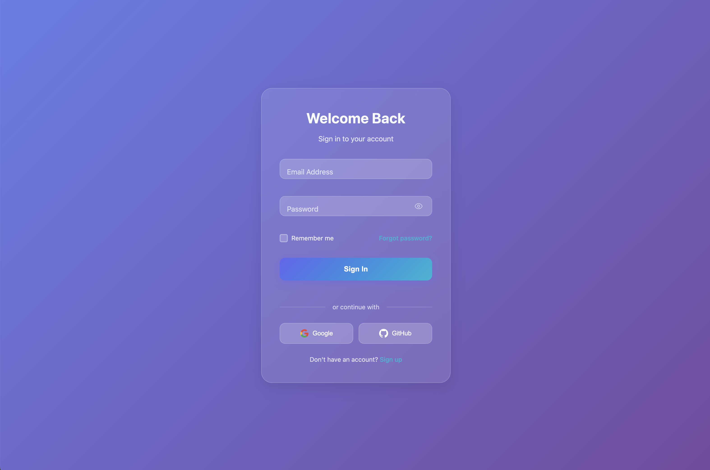
        </a>
        <br>
        <b>Glassmorphism</b>
      </td>
      <td align="center">
        <a href="forms/neon/">
          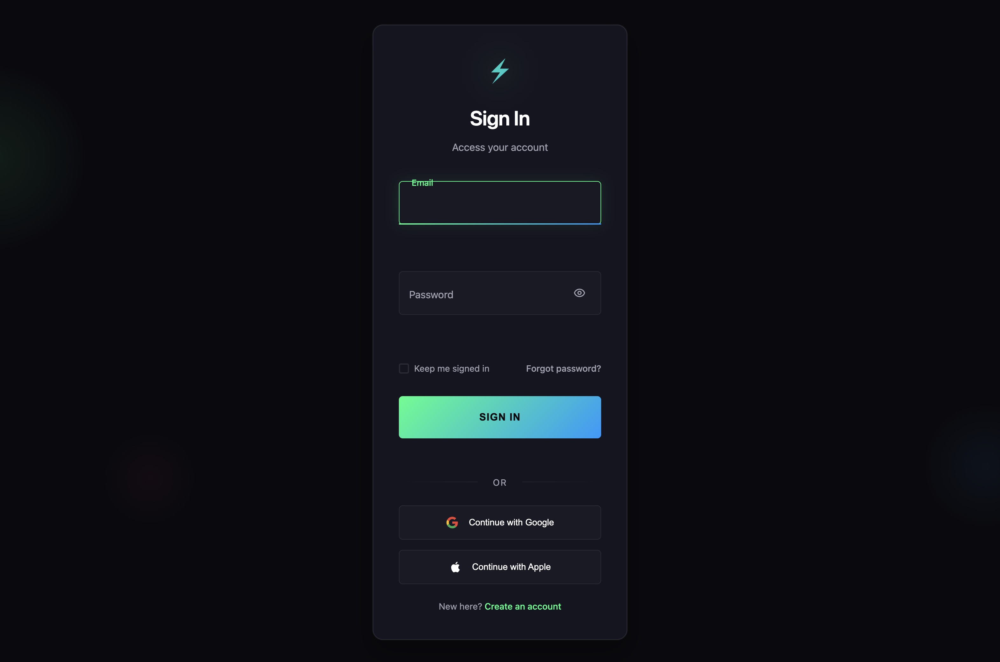
        </a>
        <br>
        <b>Neon Minimalist</b>
      </td>
      <td align="center">
        <a href="forms/gradient-wave/">
          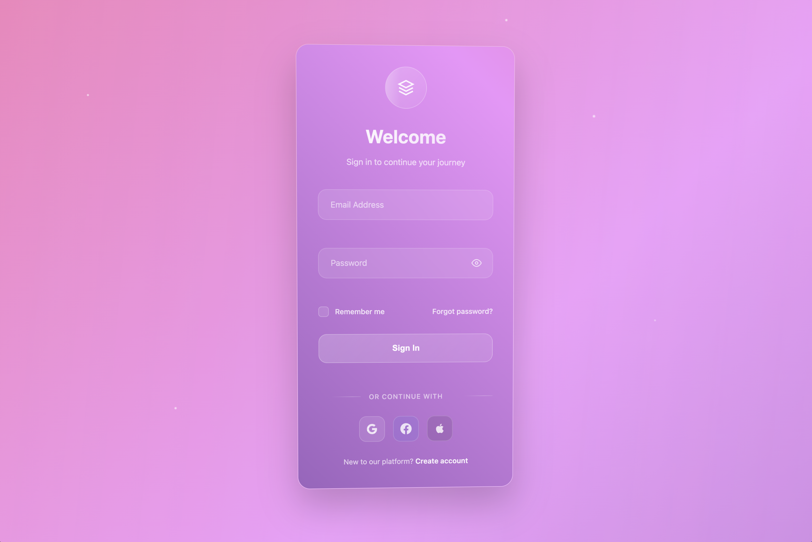
        </a>
        <br>
        <b>Gradient Wave</b>
      </td>
    </tr>
    <tr>
      <td align="center">
        <a href="forms/corporate/">
          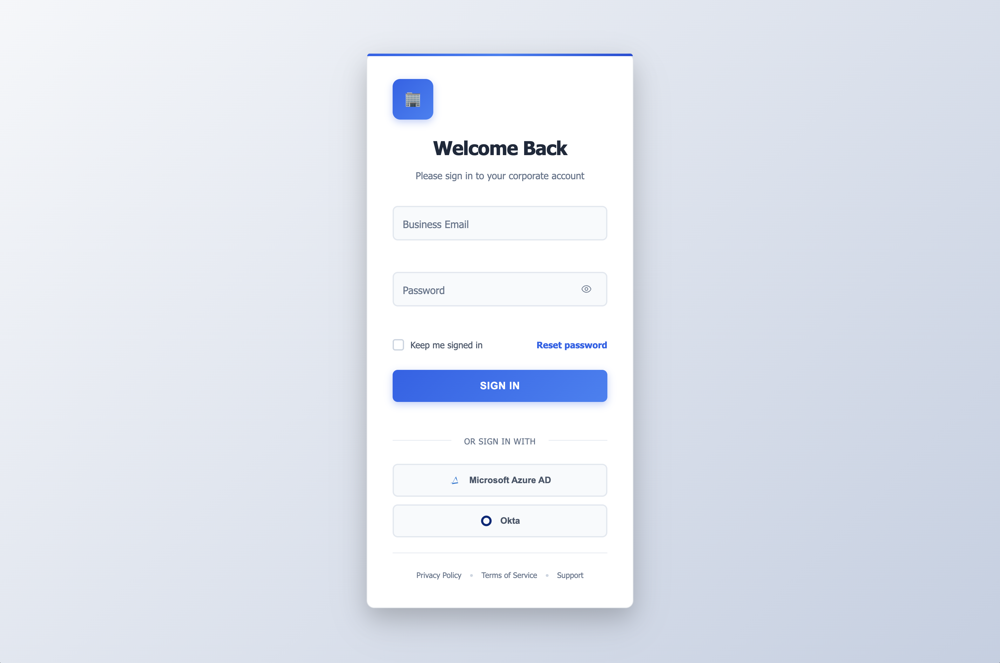
        </a>
        <br>
        <b>Corporate Professional</b>
      </td>
      <td align="center">
        <a href="forms/material/">
          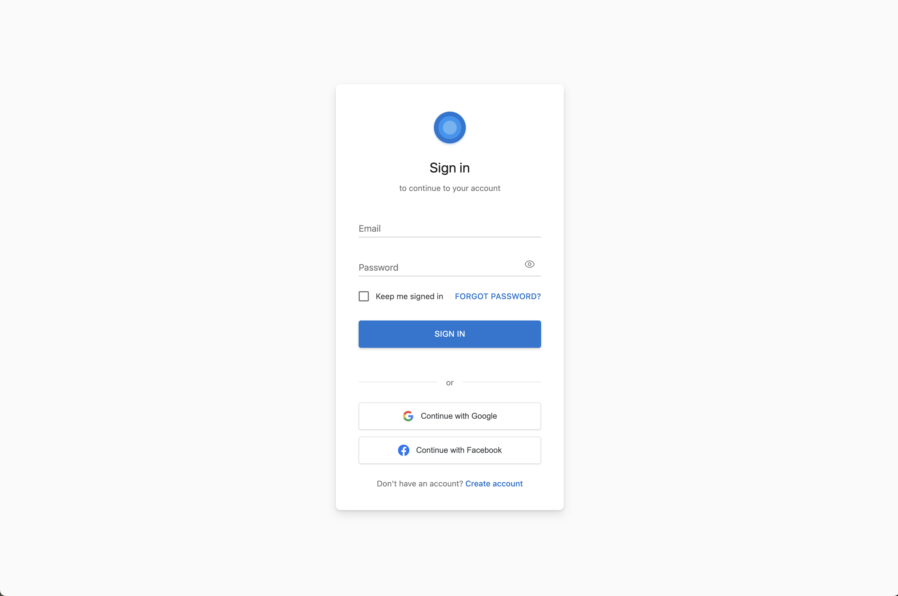
        </a>
        <br>
        <b>Material Design</b>
      </td>
      <td align="center">
        <a href="forms/neumorphism/">
          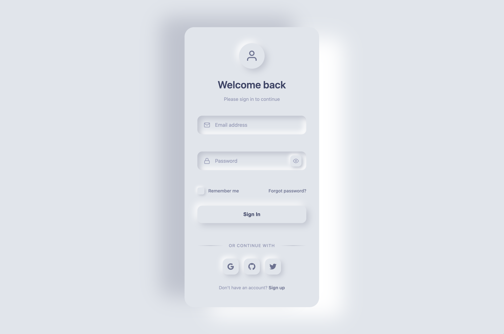
        </a>
        <br>
        <b>Neumorphism</b>
      </td>
    </tr>
    <tr>
      <td align="center">
        <a href="forms/basic/">
          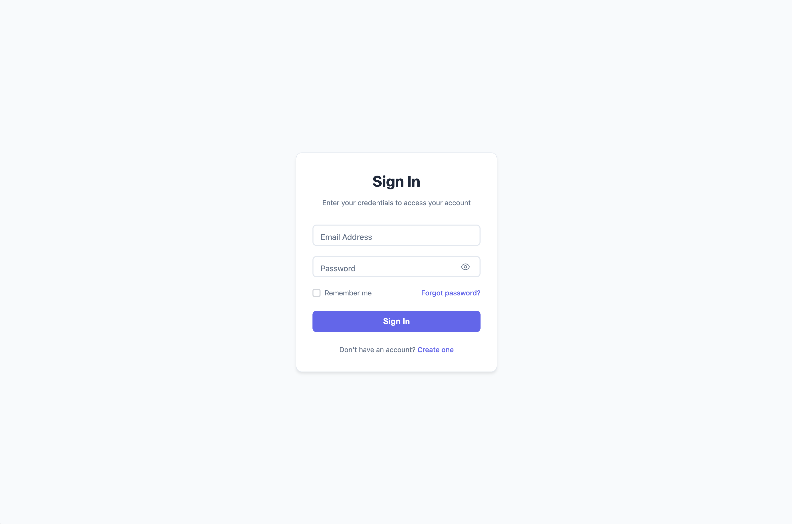
        </a>
        <br>
        <b>Basic Form</b>
      </td>
      <td align="center">
        <a href="forms/minimal/">
          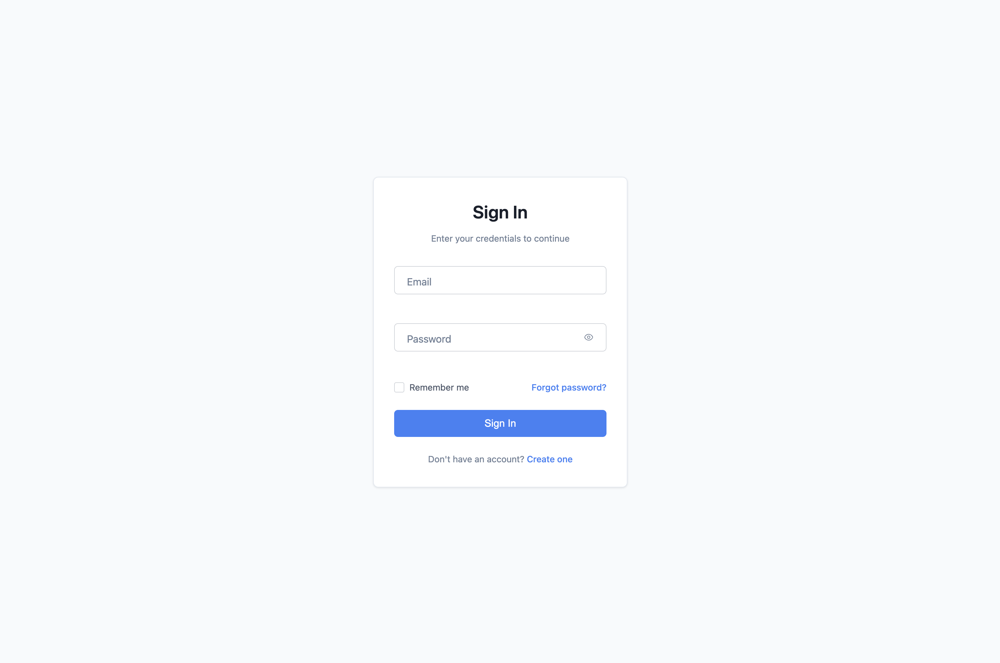
        </a>
        <br>
        <b>Minimal Clean</b>
      </td>
      <td align="center">
        <a href="forms/creative/">
          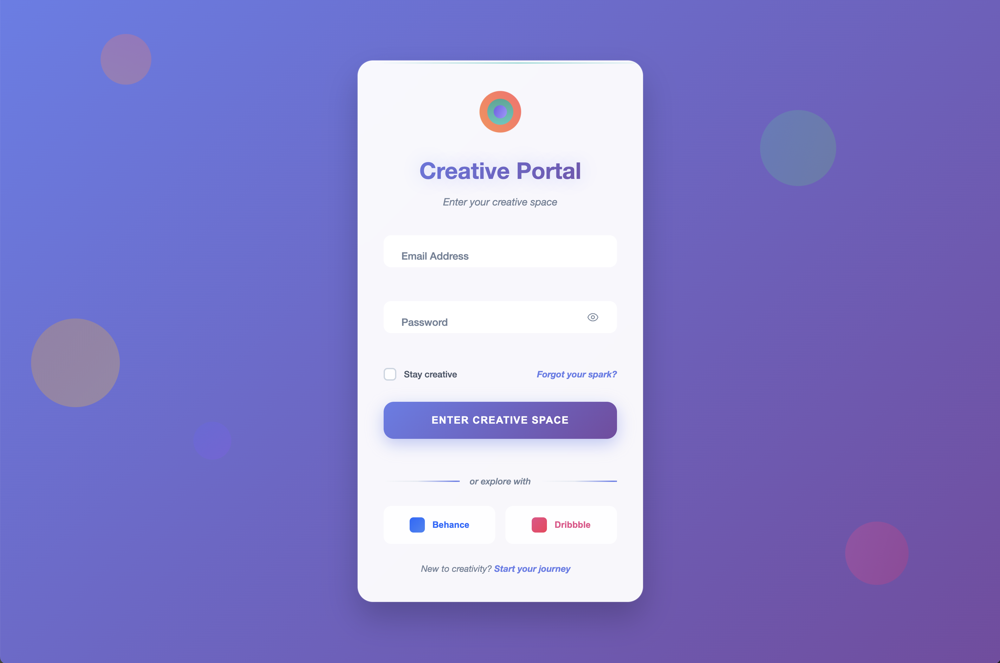
        </a>
        <br>
        <b>Creative Portal</b>
      </td>
    </tr>
    <tr>
      <td align="center">
        <a href="forms/eco-wellness/">
          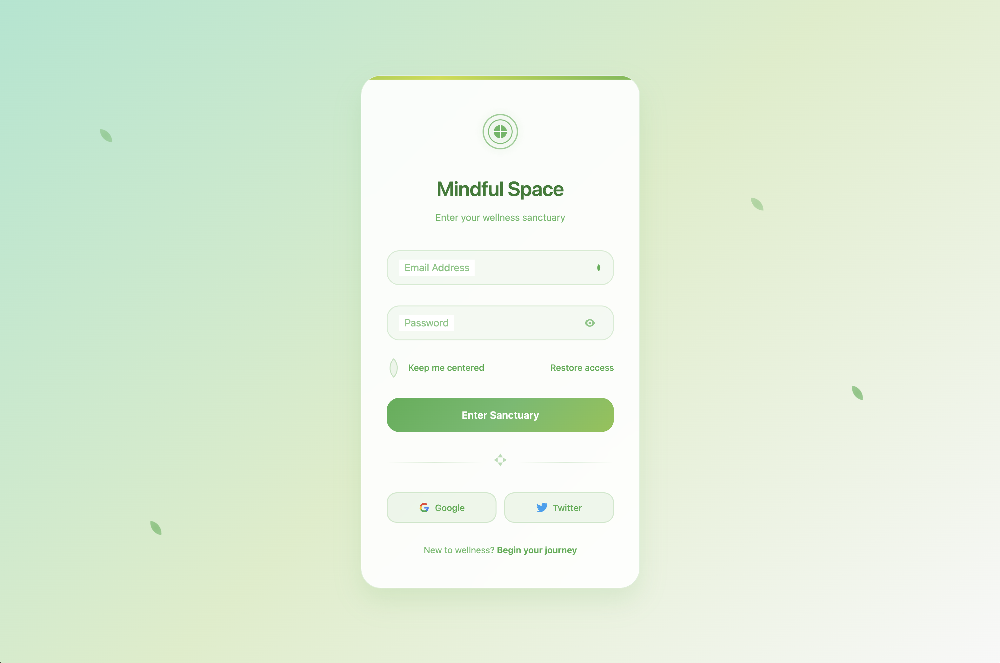
        </a>
        <br>
        <b>Eco Wellness</b>
      </td>
      <td align="center">
        <a href="forms/ai-assistant/">
          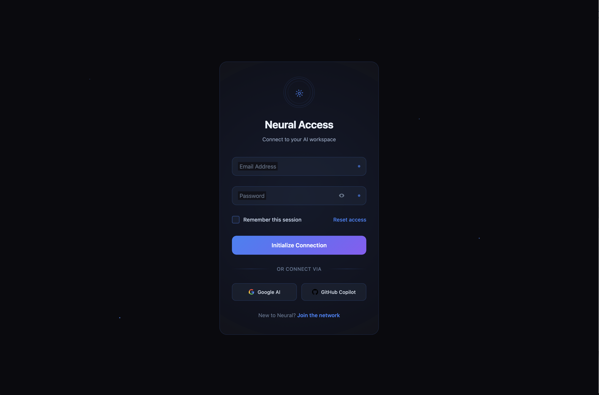
        </a>
        <br>
        <b>AI Assistant</b>
      </td>
      <td align="center">
        <a href="forms/neon-cyber/">
          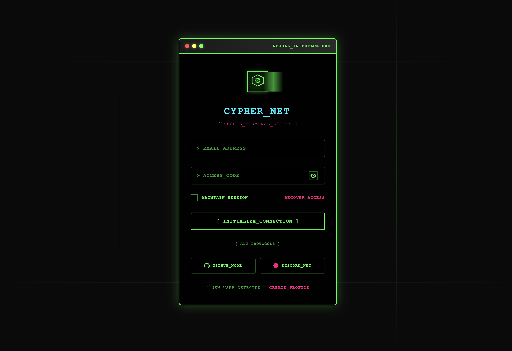
        </a>
        <br>
        <b>Neon Cyber</b>
      </td>
    </tr>
  </table>
  
  <p><a href="#-available-forms">See all 19 forms below ↓</a></p>
</div>

## 📂 Available Forms

### 🎨 Modern & Stylish
- **Glassmorphism** - Frosted glass effects with backdrop blur
- **Neon Minimalist** - Dark theme with glowing neon accents

### 💼 Corporate & Clean  
- **Corporate Professional** - Enterprise-grade with SSO integration

### 🎯 Minimal & Simple
- **Basic Form** - Simple, functional design for quick implementation
- **Minimal Clean** - Ultra-clean using system fonts

### 🎨 Creative & Artistic
- **Creative Portal** - Interactive animations with floating shapes

## 🛠️ Quick Start

1. **Browse the collection** - Open `index.html` to see all available forms
2. **Choose a form** - Click "View Demo" to see the form in action
3. **Copy the folder** - Copy the entire form directory to your project
4. **Include shared utilities** - Copy `shared/js/form-utils.js` for functionality
5. **Customize** - Modify colors and styling directly in the CSS file

## 📁 Project Structure

```
login-forms/
├── index.html                    # Main showcase page
├── shared/
│   └── js/
│       └── form-utils.js        # Shared JavaScript utilities
├── forms/                       # Form collections by category
│   ├── glassmorphism/           # Glassmorphism style forms
│   ├── neon/                    # Neon/dark theme forms
│   ├── minimal/                 # Ultra-minimal designs
│   ├── corporate/               # Professional/business forms
│   └── creative/                # Artistic/unique designs
└── docs/
    └── CLAUDE.md               # Development documentation
```

## 🎯 Form Categories

### Modern & Stylish
Latest design trends with smooth animations and modern aesthetics.

### Corporate & Clean
Professional forms suitable for business applications and corporate websites.

### Minimal & Simple
Clean, focused forms that prioritize usability and simplicity.

### Creative & Artistic
Unique, interactive forms designed for creative professionals and artistic platforms.

## 🔧 Technical Details

- **No Dependencies** - Pure HTML, CSS, and JavaScript
- **Self-Contained** - Each form includes all necessary CSS
- **Shared Utilities** - Common JavaScript functions for validation and animations
- **Mobile-First** - Responsive design optimized for all screen sizes
- **Modern Browsers** - Chrome 88+, Firefox 103+, Safari 15.4+, Edge 88+

## 📖 Documentation

Each form includes comprehensive documentation:
- Complete feature list and browser support
- Usage instructions and integration guide
- Customization options with CSS variables
- Code examples and best practices

## 🎨 Customization

All forms are designed for easy customization:
- **Colors** - Modify CSS variables for instant theme changes
- **Typography** - Use system fonts or integrate custom fonts
- **Animations** - Adjust timing and effects in CSS keyframes
- **Layout** - Responsive grid system adapts to your needs

## 🚀 Performance

- Lightweight CSS with minimal footprint
- Hardware-accelerated animations for 60fps
- Optimized images and SVG icons
- No external dependencies or CDN requirements

## 🔒 Security Features

- Client-side validation with server-side integration ready
- CSRF protection patterns included
- Secure form submission examples
- Input sanitization best practices

## 🌐 Browser Support

| Browser | Version |
|---------|---------|
| Chrome  | 88+     |
| Firefox | 103+    |
| Safari  | 15.4+   |
| Edge    | 88+     |

## 📝 License

This project is created by [Aigars Silkalns](https://github.com/silkalns) for [Colorlib](https://colorlib.com).

## 🤝 Contributing

We welcome contributions! Feel free to:
- Submit bug reports and feature requests
- Create new form designs following our guidelines
- Improve existing forms and documentation
- Share your customizations and use cases

## 📞 Support

For questions, suggestions, or support:
- Visit [Colorlib](https://colorlib.com) for more resources
- Check out [Aigars Silkalns' GitHub](https://github.com/puikinsh/) for other projects
- Open an issue in this repository for bug reports

---

**Built with ❤️ by [Aigars Silkalns](https://github.com/puikinsh/) for [Colorlib](https://colorlib.com)**