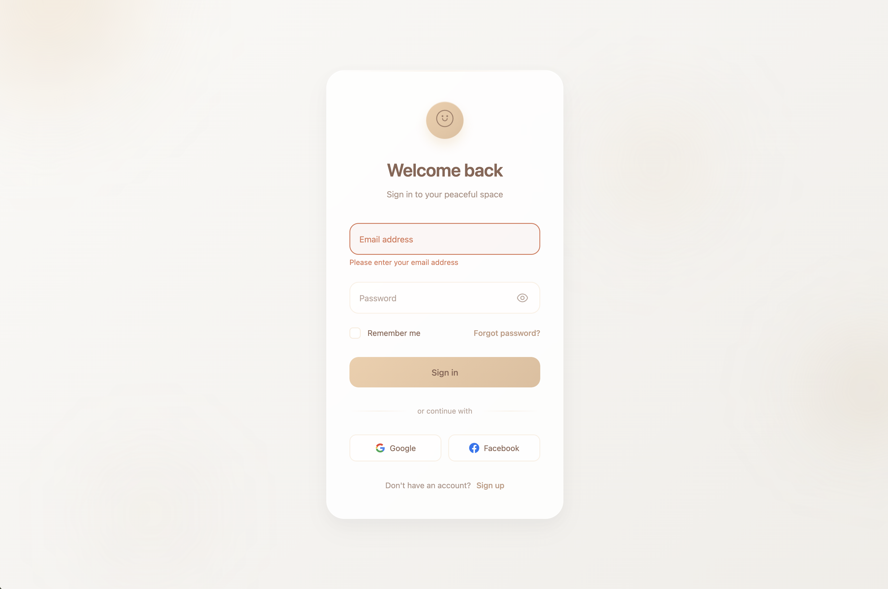
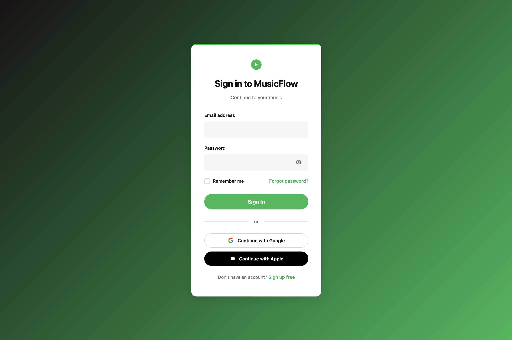
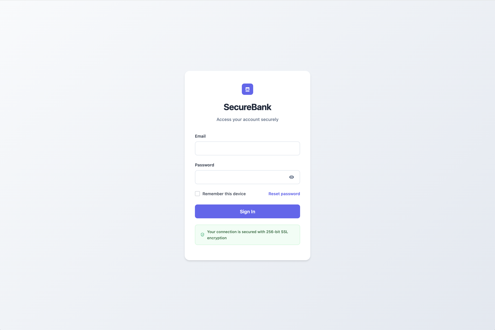
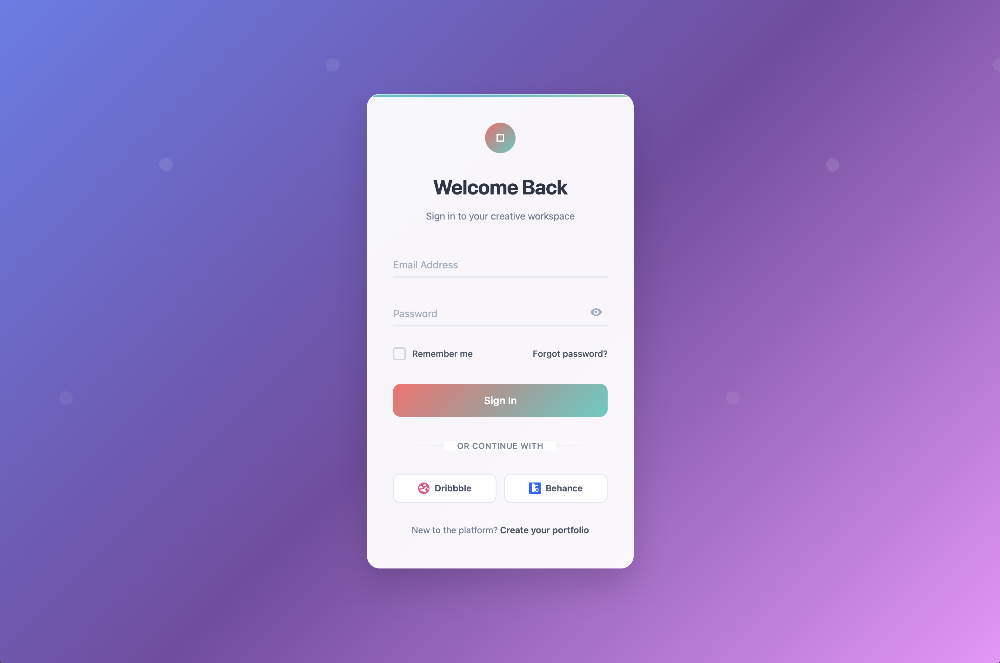

# Modern Login Forms

*Created by [Aigars Silkalns](https://github.com/puikinsh/) for [Colorlib](https://colorlib.com)*

A curated collection of beautiful, responsive login form templates built with pure HTML, CSS, and JavaScript. Each form is designed to be completely self-contained and copy-paste ready for use in any project.

## 🌟 About Colorlib

Looking for more amazing form designs? Check out Colorlib's extensive collections:
- 📋 [Login Forms Collection](https://colorlib.com/wp/cat/login-forms/) - Browse hundreds of login form designs
- 🎨 [HTML5 & CSS3 Login Forms](https://colorlib.com/wp/html5-and-css3-login-forms/) - Modern form templates and tutorials

## 🚀 Features

- **Pure HTML/CSS/JS** - No frameworks or build tools required
- **Copy-Paste Ready** - Each form is completely self-contained
- **Responsive Design** - Mobile-first approach for all devices
- **Modern Aesthetics** - Latest design trends and visual effects
- **Accessibility Focused** - WCAG 2.1 AA compliant forms
- **Cross-Browser Support** - Works on all modern browsers
- **Lightweight** - Optimized for performance

## 🖼️ Form Gallery

### Complete Collection - 19 Unique Login Forms

<div align="center">
  <table>
    <tr>
      <td align="center" width="33%">
        <a href="forms/glassmorphism/">
          
        </a>
        <br>
        <b>Glassmorphism</b><br>
        <sub>Frosted glass effects</sub>
      </td>
      <td align="center" width="33%">
        <a href="forms/neon/">
          
        </a>
        <br>
        <b>Neon Minimalist</b><br>
        <sub>Dark theme with neon</sub>
      </td>
      <td align="center" width="33%">
        <a href="forms/gradient-wave/">
          
        </a>
        <br>
        <b>Gradient Wave</b><br>
        <sub>Animated gradients</sub>
      </td>
    </tr>
    <tr>
      <td align="center">
        <a href="forms/neumorphism/">
          
        </a>
        <br>
        <b>Neumorphism</b><br>
        <sub>Soft UI design</sub>
      </td>
      <td align="center">
        <a href="forms/corporate/">
          
        </a>
        <br>
        <b>Corporate Professional</b><br>
        <sub>Enterprise-grade</sub>
      </td>
      <td align="center">
        <a href="forms/material/">
          
        </a>
        <br>
        <b>Material Design</b><br>
        <sub>Google's Material UI</sub>
      </td>
    </tr>
    <tr>
      <td align="center">
        <a href="forms/basic/">
          
        </a>
        <br>
        <b>Basic Form</b><br>
        <sub>Clean & simple</sub>
      </td>
      <td align="center">
        <a href="forms/minimal/">
          
        </a>
        <br>
        <b>Minimal Clean</b><br>
        <sub>Ultra-minimal design</sub>
      </td>
      <td align="center">
        <a href="forms/creative/">
          
        </a>
        <br>
        <b>Creative Portal</b><br>
        <sub>Interactive animations</sub>
      </td>
    </tr>
    <tr>
      <td align="center">
        <a href="forms/eco-wellness/">
          
        </a>
        <br>
        <b>Eco Wellness</b><br>
        <sub>Nature-inspired</sub>
      </td>
      <td align="center">
        <a href="forms/ai-assistant/">
          
        </a>
        <br>
        <b>AI Assistant</b><br>
        <sub>Neural network theme</sub>
      </td>
      <td align="center">
        <a href="forms/neon-cyber/">
          
        </a>
        <br>
        <b>Neon Cyber</b><br>
        <sub>Cyberpunk aesthetic</sub>
      </td>
    </tr>
    <tr>
      <td align="center">
        <a href="forms/soft-minimalism/">
          
        </a>
        <br>
        <b>Soft Minimalism</b><br>
        <sub>Warm & organic</sub>
      </td>
      <td align="center">
        <a href="forms/retro-future/">
          
        </a>
        <br>
        <b>Retro Future</b><br>
        <sub>Y2K revival style</sub>
      </td>
      <td align="center">
        <a href="forms/minimal-music/">
          
        </a>
        <br>
        <b>Minimal Music</b><br>
        <sub>Spotify-inspired</sub>
      </td>
    </tr>
    <tr>
      <td align="center">
        <a href="forms/travel-booking/">
          
        </a>
        <br>
        <b>Travel Booking</b><br>
        <sub>Travel industry theme</sub>
      </td>
      <td align="center">
        <a href="forms/clean-banking/">
          
        </a>
        <br>
        <b>Clean Banking</b><br>
        <sub>Fintech design</sub>
      </td>
      <td align="center">
        <a href="forms/modern-saas/">
          
        </a>
        <br>
        <b>Modern SaaS</b><br>
        <sub>Stripe-inspired</sub>
      </td>
    </tr>
    <tr>
      <td align="center">
        <a href="forms/elegant-portfolio/">
          
        </a>
        <br>
        <b>Elegant Portfolio</b><br>
        <sub>Creative professional</sub>
      </td>
      <td align="center">
        <a href="forms/brutalist/">
          
        </a>
        <br>
        <b>Brutalist</b><br>
        <sub>Bold & minimal</sub>
      </td>
      <td align="center">
        <!-- Empty cell for grid alignment -->
      </td>
    </tr>
  </table>
</div>

## 📂 Forms by Category

### 🎨 Modern & Stylish
- **[Glassmorphism](forms/glassmorphism/)** - Frosted glass effects with backdrop blur
- **[Neon Minimalist](forms/neon/)** - Dark theme with glowing neon accents
- **[Gradient Wave](forms/gradient-wave/)** - Dynamic gradient animations
- **[Neumorphism](forms/neumorphism/)** - Soft UI with realistic shadows

### 💼 Corporate & Clean  
- **[Corporate Professional](forms/corporate/)** - Enterprise-grade with SSO integration
- **[Material Design](forms/material/)** - Google's Material Design principles
- **[Clean Banking](forms/clean-banking/)** - Fintech-inspired professional design
- **[Modern SaaS](forms/modern-saas/)** - Stripe-inspired minimal design

### 🎯 Minimal & Simple
- **[Basic Form](forms/basic/)** - Simple, functional design for quick implementation
- **[Minimal Clean](forms/minimal/)** - Ultra-clean using system fonts
- **[Soft Minimalism](forms/soft-minimalism/)** - Warm minimalism with organic shapes
- **[Brutalist](forms/brutalist/)** - Bold, raw aesthetic

### 🎨 Creative & Artistic
- **[Creative Portal](forms/creative/)** - Interactive animations with floating shapes
- **[Retro Future](forms/retro-future/)** - Y2K revival with chrome effects
- **[Elegant Portfolio](forms/elegant-portfolio/)** - Dribbble-inspired creative design

### 🌟 Themed & Unique
- **[AI Assistant](forms/ai-assistant/)** - Neural network-inspired design
- **[Eco Wellness](forms/eco-wellness/)** - Nature-inspired with organic shapes
- **[Neon Cyber](forms/neon-cyber/)** - Cyberpunk gaming aesthetic
- **[Minimal Music](forms/minimal-music/)** - Spotify-inspired clean design
- **[Travel Booking](forms/travel-booking/)** - Travel industry themed

## 🛠️ Quick Start

### 1. Browse & Choose
Open `index.html` in your browser to see all forms in action with live previews.

### 2. Copy Form Files
Each form is self-contained in its own directory:
```
forms/[form-name]/
├── index.html    # Form HTML structure
├── style.css     # Complete styling
├── script.js     # Form functionality
└── README.md     # Documentation
```

### 3. Include Dependencies
Copy the shared utilities:
```
shared/js/form-utils.js    # Common form functionality
```

### 4. Customize
- Modify colors and styling in `style.css`
- Adjust validation rules in `script.js`
- Update text and labels in `index.html`

## 📁 Project Structure

```
login-forms/
├── index.html                    # Main showcase page
├── shared/
│   └── js/
│       └── form-utils.js        # Shared JavaScript utilities
├── forms/                       # All form templates
│   ├── glassmorphism/
│   ├── neon/
│   ├── minimal/
│   └── ... (19 forms total)
├── assets/
│   └── screenshots/             # Form preview images
└── docs/
    ├── design-guide.md
    └── screenshot-integration-guide.md
```

## 🎯 Form Features

Each form includes:
- ✅ Email and password inputs with validation
- ✅ Floating label animations
- ✅ Password visibility toggle
- ✅ Real-time validation feedback
- ✅ Loading and success states
- ✅ Responsive mobile-first design
- ✅ Accessibility features (ARIA labels, keyboard navigation)
- ✅ Remember me checkbox
- ✅ Forgot password link
- ✅ Sign up link

## 🎨 Customization Guide

### Colors & Theming
Each form uses CSS variables or inline styles that can be easily modified:
- Primary colors
- Background gradients
- Text colors
- Border styles

### Form Validation
Validation rules in `shared/js/form-utils.js`:
- Email format validation
- Password strength requirements
- Custom error messages
- Success confirmations

### Animations
- Entrance animations
- Hover effects
- Focus transitions
- Success celebrations

## 🔧 Technical Details

### Browser Support
| Browser | Version |
|---------|---------|
| Chrome  | 88+     |
| Firefox | 103+    |
| Safari  | 15.4+   |
| Edge    | 88+     |

### Performance
- No external dependencies
- Lightweight CSS animations
- Optimized for fast loading
- Lazy loading for images

### Accessibility
- Semantic HTML structure
- ARIA labels and roles
- Keyboard navigation support
- High contrast ratios
- Screen reader friendly

## 🤝 Contributing

We welcome contributions! Feel free to:
- Submit bug reports and feature requests
- Create new form designs following our guidelines
- Improve existing forms and documentation
- Share your customizations and use cases

## 📝 License

This project is created by [Aigars Silkalns](https://github.com/puikinsh) for [Colorlib](https://colorlib.com).

## 📞 Support & Resources

- 🌐 Visit [Colorlib](https://colorlib.com) for more web design resources
- 📋 Browse [Login Forms Collection](https://colorlib.com/wp/cat/login-forms/)
- 🎨 Explore [HTML5 & CSS3 Login Forms](https://colorlib.com/wp/html5-and-css3-login-forms/)
- 💻 Check out [Aigars Silkalns' GitHub](https://github.com/puikinsh/) for other projects
- 🐛 Open an issue in this repository for bug reports

---

**Built with ❤️ by [Aigars Silkalns](https://github.com/puikinsh/) for [Colorlib](https://colorlib.com)**